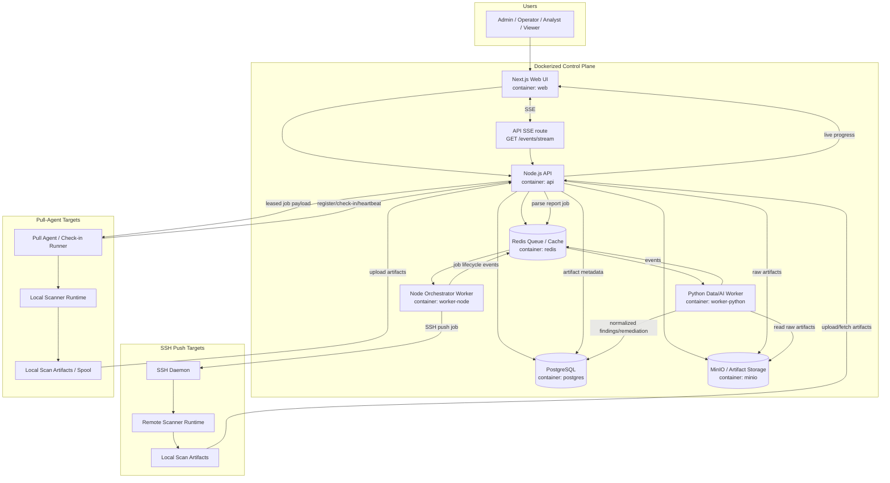

# Shore Sentinel Control Plane Architecture Proposal

_Original plan generated via Hermes one-shot using `--provider openai-api --model gpt-5.5`; updated with owner decisions and Dockerized implementation recommendations._

> **Revision note:** This version adds a UI/UX review (see "UI/UX Review and Simplification Plan" immediately following the Web UI component section) that tightens the visual design guardrails, resolves the dual-mode dashboard ambiguity, restructures navigation, and scopes filters per view. Original requirements are left intact below for traceability; the review section states what changes and why.

## Executive Summary

This document defines the architecture for a web application/control plane that manages an agent-security self-check scanner across many target machines.

The system will:

- onboard target machines via SSH push and/or pull-based agent check-in
- launch and track scanner runs across heterogeneous environments
- ingest JSON, Markdown, SARIF, and PDF artifacts
- present live progress, machine history, report views, dashboards, trends, and remediation guidance
- remain framework-agnostic and provider/model-agnostic unless a specific runtime is truly required
- run as a Dockerized application stack from this workspace under `apps/shore-sentinel/`

The recommended design separates the **control plane** from the **scanner runtime**. The scanner remains a portable, read-only execution bundle that can run on target machines directly. The web app provides orchestration, scheduling, monitoring, reporting, analytics, and artifact retention.

At the product level, Shore Sentinel is a **security scanning, audit, and inventory app** with two primary operating paths:

1. **GitHub scanner option** — run standalone local evidence collection from the published scanner instructions outside the app workflow.
2. **Add Managed Machine** — enroll a machine into Shore Sentinel so the system can track status, run scans, preserve inventory/history, schedule future runs, and generate recurring reports.

---

## Product Logic and Operating Modes

Shore Sentinel should make the first user decision explicit:

```text
What do you want to do?
1. Run a one-time audit
2. Add a machine to Shore Sentinel
```

### Mode 1: GitHub scanner option

A one-time audit is for ad hoc validation, incident review, vendor/client evidence collection, or testing a host before deciding whether to enroll it.

Expected behavior:

- user provides temporary target connection details or chooses an existing approved target
- system creates an ephemeral audit job
- scanner runs once through SSH push or an approved temporary runner path
- JSON/Markdown/SARIF/PDF artifacts are generated
- reports are stored in MinIO according to retention policy
- findings and remediation guidance are visible in the UI
- the machine does **not** become a continuously monitored managed machine unless the user promotes it

One-time audit records should still be searchable and auditable, but should be clearly marked as:

```text
asset_mode = one_time_audit
```

### Mode 2: Add Managed Machine

A managed machine is enrolled into Shore Sentinel as an ongoing inventory/security asset.

Expected behavior:

- user adds machine metadata and environment classification
- system records ownership, tenant, environment, and connection mode
- machine status is monitored through heartbeat/check-in or SSH reachability checks
- scan jobs can be run manually or on a schedule
- reports and historical scan results are preserved
- dashboard trends include this machine in fleet health and security posture views
- informational notifications can be generated for offline state, scan failures, report readiness, and notable findings

Managed machine records should be marked as:

```text
asset_mode = managed_machine
```

### Promotion path

A one-time audit target can be promoted to a managed machine if the user decides it should become part of inventory.

Promotion should preserve:

- original audit artifacts
- first-seen timestamp
- scanner version and script hash
- initial findings and remediation guidance

Promotion should add:

- environment
- owner/team metadata
- connection mode
- monitoring policy
- scan schedule, if any

### Core product capabilities

Shore Sentinel combines three product domains:

| Domain | Capability |
|---|---|
| Security scanning | run scanner, collect findings, severity, remediation, evidence |
| Audit/reporting | retain JSON/MD/SARIF/PDF artifacts, prove scan history, export reports |
| Inventory/monitoring | track managed machines, status, environment, history, schedules |

---

## MVP Definition

In this document, **MVP** means **Minimum Viable Product**: the smallest production-credible version that proves the core value loop end-to-end.

For this product, the MVP is not just a mockup. It should prove both operating paths:

1. A user uses the **GitHub scanner option** against a machine.
2. A user adds a **managed machine** to Shore Sentinel inventory.
3. A scan job is created from either path.
4. The scanner runs through SSH push or an approved runner path.
5. JSON/Markdown/SARIF/PDF artifacts are received.
6. The system stores the run, findings, remediation guidance, and artifacts.
7. The UI shows target status, target history, report details, and a basic dashboard.
8. A managed machine can have scheduled future scans or reports.
9. The whole stack runs locally via Docker Compose.

### MVP includes

- Dockerized Next.js frontend
- Dockerized Node.js backend API
- PostgreSQL source-of-truth database
- Redis-backed queue/event coordination
- Python data/report worker
- artifact storage using MinIO
- one-time audit flow
- managed machine enrollment flow
- target inventory with environment grouping
- managed machine status monitoring
- manual scan job lifecycle tracking
- scheduled scans or scheduled report generation for managed machines
- artifact upload and report viewer
- basic dashboard and historical runs
- knowledgebase and how-to collection, especially for running one-time audits and adding managed machines
- single-tenant deployment model with no tenant switching in the UI
- informational notifications only

### MVP excludes

- full enterprise SSO/IdP integration
- multi-region high availability
- advanced analytics warehouse
- automatic remediation execution
- complex approval workflows before scans
- full fleet automation policies
- long-term SIEM integrations

Those can come after the vertical slice is proven.

---

## Chosen Technology Stack

Use this stack for the initial application:

| Layer | Technology | Decision |
|---|---|---|
| Frontend | Next.js | Primary web UI: dashboard, inventory, reports, history, dark mode |
| Backend API | Node.js | Main API, local auth, settings, jobs, pull-agent endpoints, artifacts |
| API framework | NestJS or Fastify | Prefer NestJS for structured modules; Fastify is acceptable if keeping it lean |
| Database | PostgreSQL | Source of truth for users, roles, settings, targets, jobs, runs, findings, remediation, audit logs |
| Queue/cache | Redis | Queue, leases, progress events, worker coordination |
| Node worker | Node.js + BullMQ | Job orchestration, scheduling, SSH push lifecycle |
| Python worker | Python worker consuming Redis jobs | Report parsing, SARIF normalization, remediation enrichment, analytics aggregation; no public HTTP service for MVP |
| Artifact storage | MinIO (private Docker service) | S3-compatible storage for JSON/MD/SARIF/PDF artifacts |
| Realtime | API-hosted SSE | Live job progress and report-ready events via `GET /events/stream`; no separate realtime container for MVP |
| Runtime | Docker / Docker Compose | Local and server deployment baseline |
| Scanner distribution | Script bundle | Main scanner plus helper modules; no hard UI/backend coupling |

### Important stack decision

Use **synchronous artifact receipt** and **asynchronous artifact processing**.

That means:

1. API receives upload and validates type, size, hash, and run ownership.
2. API stores raw artifact and metadata immediately.
3. API marks the artifact as `uploaded`.
4. API enqueues parsing/normalization work in Redis.
5. Python worker parses and normalizes findings.
6. UI shows state transition: `uploaded → processing → ready`.

This reconciles the owner preference for synchronous completion with the safer worker-based architecture.

### Canonical job, run, and artifact path

Use one canonical execution model for both one-time audits and managed machines.

- `scan_jobs` represents requested work.
- `scan_runs` represents an actual execution attempt.
- A job/run subject is either a managed machine or a one-time audit, never both.
- Model this with:
  - `subject_type: managed_target | one_time_audit`
  - nullable `target_id`
  - nullable `one_time_audit_id`
  - a database constraint requiring exactly one subject reference.

Canonical launch paths:

- `POST /one-time-audits/{id}/run` creates a scan job for a one-time audit.
- `POST /targets/{id}/scan-jobs` creates a scan job for a managed machine.
- Generic `POST /scan-jobs` is internal/admin-only unless the UI later needs a unified advanced job form.
- `/targets/{id}/ssh-run` should not be a public competing launcher; reserve it for diagnostic/admin-only execution if implemented.

Canonical SSH push artifact path:

1. Node orchestrator connects to the approved target over SSH.
2. Node orchestrator invokes the scanner bundle on the target.
3. Node orchestrator fetches the output directory from the target.
4. Node orchestrator submits artifacts to the API artifact upload/completion endpoints.
5. API validates file type, size, hash, run ownership, and retention policy.
6. API writes raw artifacts to MinIO and metadata to PostgreSQL.
7. API enqueues parsing/normalization in Redis for the Python worker.

Workers should not write directly to MinIO or artifact tables except through approved internal API paths. This keeps artifact validation, audit logging, and retention policy enforcement in one place.

---

## Workspace Location and App Folder

Create the application in this workspace under:

```text
apps/shore-sentinel/
```

Recommended layout:

```text
apps/shore-sentinel/
├── README.md
├── docker-compose.yml
├── .env.example
├── web/
├── api/
├── workers/
│   ├── worker-node/
│   └── worker-python/
├── packages/
│   └── shared/
├── scanner-bundle/
├── infra/
│   ├── postgres/
│   ├── redis/
│   └── minio/
└── docs/
```

The legacy `scripts/security-tools/agent-security-selfcheck/` tree should remain the source/history area for the scanner itself unless a specific file is intentionally promoted into the Shore Sentinel app. The new app should consume a packaged scanner bundle rather than moving every historical script and report file wholesale.

This keeps the product separate from the existing scanner scripts while still living in the same workspace.

---

## Recommended Architecture

Use a **control-plane / data-plane** architecture.

### Control plane

- Next.js web UI
- Node.js API backend
- AuthN/AuthZ and single-deployment scoping
- Target inventory
- Job orchestration
- Artifact ingestion
- Report normalization
- Dashboards and analytics
- Notification/event streaming

### Data plane

- Portable scanner script bundle
- SSH push executor
- Pull-agent/check-in runner path
- Local target-machine execution
- Artifact upload/sync path

### Scanner bundle contract

The app should consume a packaged scanner bundle with a stable contract.

Minimum MVP contract:

- Entrypoint command: `python3 Agent_Security_Selfcheck_v3.5.1.py --target <dir> --scope-mode exact --out-dir <dir>` or a wrapper that preserves equivalent behavior.
- Supported target runtime: Linux hosts with `python3`; Windows/macOS support can be added later only after validation.
- Required arguments: output directory, non-interactive mode, and optional metadata such as run ID or hostname.
- Output directory must contain JSON, Markdown, SARIF, and PDF artifacts when the scanner succeeds.
- Artifact filenames must include scanner version and timestamp or run ID.
- Scanner must emit a machine-readable JSON result even when some checks fail.
- Exit code `0` means the scan completed and artifacts were generated; non-zero means execution failed and the run should be marked failed.
- Timeout behavior must be controlled by the Node orchestrator, with partial logs captured as job events.
- Every run records `scanner_bundle_version`, `scanner_script_sha256`, and app version.
- Minimum normalized fields: finding ID/title, severity, status, category, evidence summary, remediation text, source artifact, and affected target/run.

### Key principles

- The scanner stays portable and decoupled from the web UI, backend, framework, and model/provider stack.
- The control plane stores job state, target inventory, scan metadata, and artifact references.
- Push and pull modes use the **same run model**.
- SARIF is treated as a **first-class canonical input/output**, alongside JSON, Markdown, and PDF.
- Remediation guidance is scanner-generated and read-only: the app recommends actions but does not execute remediation.
- Single-tenancy is the product scope for MVP; do not build tenant switching or multi-tenant admin UX.
- Analytics start in PostgreSQL; a read-optimized store can be added later only if needed.

### Authentication, roles, and permissions

Shore Sentinel is **single-tenant only**. Tenant scoping is therefore simplified, but role-based access control still applies.

The permission model uses four actions everywhere it makes sense:

- `read`
- `add`
- `edit`
- `delete`

These permissions should be applied per feature area, not as one global toggle. Every role should have a configurable checklist that can be customized by feature set and deployment needs.

Recommended baseline roles:

| Role | Intended use | Typical permissions |
|---|---|---|
| Admin | Full platform administration | read, add, edit, delete |
| Operator | Day-to-day security operations | read, add, edit |
| Analyst | Review, triage, reporting | read, add |
| Viewer | Read-only oversight | read |

Role checklists should be feature-oriented. For example:

- Inventory: target records, environments, schedules, status checks
- Scans & Reports: run scans, view reports, compare reports, export reports
- Remediation: review, track, close, or delete remediation items
- Knowledgebase: read, add, edit, delete how-to articles
- Logs: read event history and notification history
- Settings: manage SMTP, alert templates, retention policy, and role configuration

The exact feature checklist for each role should be customizable in the admin UI, but the permission granularity should remain limited to the four actions above.

#### Baseline role permission matrix

Use this as the initial seed matrix. Admins can customize it later in Settings, but the MVP should start with these defaults.

Legend: `R` = read, `A` = add, `E` = edit, `D` = delete, `—` = no access by default.

| Feature area | Admin | Operator | Analyst | Viewer |
|---|---|---|---|---|
| Central Dashboard | R/A/E/D | R | R | R |
| Inventory / Managed Machines | R/A/E/D | R/A/E | R | R |
| Environments / Grouping | R/A/E/D | R/A/E | R | R |
| GitHub scanner option | External docs | External docs | External docs | — |
| Managed Machine Schedules | R/A/E/D | R/A/E | R | R |
| Scan Jobs / Live Progress | R/A/E/D | R/A/E | R/A | R |
| Reports / Artifacts | R/A/E/D | R/A/E | R | R |
| Import / Export Reports | R/A/E/D | R/A | R | R |
| Comparison / Analytics | R/A/E/D | R | R | R |
| Remediation Workflows | R/A/E/D | R/A/E | R/A/E | R |
| Knowledgebase | R/A/E/D | R/A/E | R/A/E | R |
| Logs Page | R/A/E/D | R | R | R |
| Alert Rules | R/A/E/D | R/E | R | — |
| Email Templates | R/A/E/D | R/E | R | — |
| SMTP Settings | R/A/E/D | — | — | — |
| Retention Policy | R/A/E/D | R | R | — |
| Role Configuration | R/A/E/D | — | — | — |
| System Health / Release Status | R/A/E/D | R | R | R |

Destructive actions such as deleting reports, machines, logs, roles, SMTP settings, or retention policies should require an Admin role by default even if the permission matrix is later customized.

---

## Full Dockerized System Diagram



---

## Component Breakdown

### 1. Web UI — Next.js

Responsibilities:

- first-action landing screen focused on `Add Managed Machine`; standalone scanner usage remains in the GitHub README
- single-tenant central dashboard
- target inventory by environment
- one-time audit history view
- managed machine detail page
- live scan progress
- historical runs per machine
- report browsing and artifact download
- report comparison between scans as an optional feature
- remediation summaries and filtering
- import/export options for reports
- knowledgebase and how-to area with guided documentation for one-time audits, managed-machine enrollment, scheduling, report review, and troubleshooting
- contextual help links from managed-machine flows into the relevant how-to articles
- UI/UX direction inspired by a modern dark SaaS dashboard: restrained glassmorphism panels, subtle neon accents, layered cards, soft shadows, faint grid texture, and premium high-contrast typography
- dark mode is the default visual language; light mode can be added later if needed
- visual effects must be restrained and never compete with operational data, findings, status, or calls to action
- avoid excessive animation, glow, gradients, decorative noise, or dense visual layering that distracts from scan/report decisions
- report and dashboard components should feel polished, focused, dense, and operational rather than playful or decorative
- responsive layout for large desktop screens first, with graceful tablet scaling

Design guardrails:

- prioritize clarity over visual novelty
- keep the first-action screen simple: only the two primary choices plus concise supporting copy
- use accent colors sparingly for status, severity, and primary actions only
- maintain strong contrast and readable typography for long audit/report sessions
- keep charts simple and decision-oriented; avoid decorative graphs that do not answer an operational question
- default to progressive disclosure: show summaries first, then drill-down details
- minimize modal usage; prefer inline panels and dedicated detail pages for complex tasks
- keep navigation stable and predictable across audit, inventory, report, remediation, and knowledgebase areas

Requirements:

- realtime updates through API-hosted SSE
- filters scoped by view: environment/status for inventory; severity/time range/environment for reports and remediation
- separate views for inventory, execution, reporting, and analytics
- clear indication that alerts/notifications are informational only

---

## UI/UX Review and Simplification Plan

The original Web UI requirements above are directionally correct but contain unresolved tensions that, left as-is, risk producing an over-complicated, distracting interface despite the doc's own stated guardrails. This section identifies what holds up, what doesn't, and the concrete changes to make before implementation.

### What holds up as written

- The first-action screen should be managed-machine-first and avoid presenting local evidence runs as an in-app workflow.
- Progressive disclosure (summaries first, drill-down second) is the correct default.
- Minimizing modal usage in favor of inline panels and dedicated detail pages is correct for complex, multi-step operational tasks.
- Dark-mode-default is reasonable for a tool used during long report-review sessions.

### Where the original requirements conflict with their own guardrails

1. **"Restrained glassmorphism" has no enforceable boundary.** Glassmorphism (blur, translucency, layered panels) is visually expensive by nature: it pulls contrast down exactly where findings/severity text needs it most, which directly fights the stated goal of "premium high-contrast typography." "Restrained" is not a testable instruction for a developer.
2. **One dashboard is being asked to serve two structurally different asset types.** `one_time_audit` and `managed_machine` records have different lifecycles, but the dashboard responsibilities (fleet health, audit history, severity trends, remediation backlog) are listed as one undifferentiated surface. Without a split, one-time audits will either pollute fleet trend charts or the dashboard logic will grow ad hoc branching to hide them.
3. **Five navigation areas are listed as flat peers with no hierarchy.** "Audit, inventory, report, remediation, and knowledgebase" given equal weight invites a cluttered top-level nav before any code exists. Knowledgebase is reference material, not a daily-use area, and remediation is a derived view of findings rather than an independent domain.
4. **The filter list is specified globally, not per view.** Tenant, environment, status, severity, and time range as one flat list reads as "apply all five everywhere." Most users are scoped to a single tenant and should never see a tenant selector; severity/time-range filters belong on findings/report views, not inventory.
5. **No empty-state / first-run specification exists.** The first-action screen is well-specified for an existing tenant, but nothing defines what a brand-new tenant's dashboard shows before any scan has ever run.
6. **Secondary actions (report comparison, import/export) are listed as core responsibilities**, which risks them accumulating as permanent toolbar buttons on the primary report view rather than staying secondary.
7. **"Avoid excessive animation" is a vibe, not a spec** — unenforceable as worded, and the most common way "restrained" visual direction drifts into decorative territory over successive sprints.

### Recommended changes

| # | Area | Change |
|---|---|---|
| 1 | Visual contract | Replace "restrained glassmorphism" with a concrete rule: **solid panel backgrounds only** (no blur/translucency) on any panel containing findings, severity, or report data. Glass/blur effects are permitted only on non-data chrome — top nav bar, login screen, empty-state illustrations. |
| 2 | Dashboard structure | **Split the dashboard by asset mode.** Default post-login view = managed-machine fleet health only (the four dashboard questions apply to managed assets, where trend-over-time is meaningful). One-time audits get a separate **Audit History** list view with an explicit **Promote to Managed Machine** action; they do not appear in fleet trend charts unless promoted. |
| 3 | Navigation | Collapse to **three primary nav items**: **Inventory** (managed machines + environments), **Scans & Reports** (execution, history, report viewer — shared by audit and managed scans), **Remediation** (cross-cutting findings view). **Knowledgebase** becomes a secondary/de-emphasized link (e.g., footer or help icon), not a primary tab. |
| 4 | Filters | Scope filters to the view rather than applying all five everywhere: Inventory → environment + status. Scans & Reports / Remediation → severity + time range + environment. No tenant selector appears in MVP because the product is single-tenant. |
| 5 | Empty state | New tenant with zero scans shows the primary `Add Managed Machine` action, report guidance, and one knowledgebase link — nothing else. No placeholder charts, no empty trend graphs. |
| 6 | Secondary actions | Move **report comparison** and **import/export** out of the primary report-viewer toolbar into a secondary **Actions** menu on the report detail page. The primary report view shows findings, severity, and remediation only. |
| 7 | Motion | Replace "avoid excessive animation" with an enforceable rule: motion is permitted **only** for state transitions that convey real information (e.g., `uploaded → processing → ready`, live SSE progress), capped at roughly 200ms, with no decorative hover/load micro-animations. |

### Updated design guardrails (supersedes the original list below)

- prioritize clarity over visual novelty
- keep the first-action screen simple: only the two primary choices plus concise supporting copy
- solid backgrounds for any panel showing operational data; blur/translucency confined to non-data chrome only
- use accent colors sparingly for status, severity, and primary actions only
- maintain strong contrast and readable typography for long audit/report sessions
- keep charts simple and decision-oriented; avoid decorative graphs that do not answer an operational question
- default to progressive disclosure: show summaries first, then drill-down details
- minimize modal usage; prefer inline panels and dedicated detail pages for complex tasks
- three primary nav areas (Inventory, Scans & Reports, Remediation); Knowledgebase is secondary, not a primary tab
- filters are scoped per view, not applied globally; no tenant selector in MVP
- dashboard reflects managed-machine fleet health by default; one-time audits live in a separate Audit History view until promoted
- motion is reserved for real state transitions only, capped at ~200ms, with no decorative animation

---

### 2. Backend API — Node.js


Responsibilities:

- authentication and authorization
- tenant and environment scoping
- one-time audit job creation
- managed machine registration and metadata management
- scan job creation and scheduling
- pull-agent registration/check-in/heartbeat endpoints
- artifact upload initiation and completion endpoints
- report and dashboard APIs
- knowledgebase/how-to article APIs
- audit logging for all operator actions

Recommended implementation:

- NestJS for structured modules, guards, DTOs, OpenAPI, and background integration
- Prisma or Drizzle for PostgreSQL access
- BullMQ for Redis-backed queues if using Node-native job orchestration

### 3. Node Orchestrator Worker

Responsibilities:

- scan job state machine
- SSH push execution lifecycle
- scheduling and retries
- timeouts and concurrency limits
- job leases for pull mode
- lifecycle events into Redis/PostgreSQL

### 4. Python Data/AI Worker

Responsibilities:

- parse JSON, Markdown, SARIF, and PDF metadata
- normalize findings into canonical records
- deduplicate finding definitions vs finding instances
- compute summaries and dashboard aggregates
- enrich scanner-generated remediation data
- optionally perform AI-assisted report summarization later

Important boundary:

- AI/data workers may enrich reports, but they must not become the source of truth for scanner results.
- The scanner remains framework-agnostic and provider/model-agnostic.
- Any future AI summarization must be optional and clearly labeled.

### 5. PostgreSQL

Responsibilities:

- source-of-truth relational data
- tenants, users, roles
- one-time audit target records
- managed targets and environments
- scan jobs and runs
- schedules for managed machines
- job events
- findings and remediation items
- artifact metadata
- audit logs
- retention policies
- knowledgebase and how-to articles
- summary tables/materialized views for dashboard performance

### 6. Redis

Responsibilities:

- queues
- worker coordination
- progress pub/sub
- job leases
- retry scheduling
- short-lived event buffers

### 7. MinIO / Artifact Storage

Responsibilities:

- immutable raw artifact storage
- JSON reports
- Markdown reports
- SARIF reports
- PDF reports
- future attachments/screenshots if needed

For Docker MVP, MinIO is preferred over storing report files only in the API container filesystem.

---

## SSH Push Flow

### Intent

The control plane connects to an approved target machine through SSH, runs the scanner bundle, and retrieves artifacts.

### Flow

1. Operator registers an approved target with SSH metadata.
2. API stores target metadata and vault/sealed credential reference.
3. User starts a scan or a schedule creates one.
4. API creates a `scan_job` and enqueues orchestration work in Redis.
5. Node orchestrator worker claims the job.
6. Worker connects to target over SSH using approved credentials.
7. Worker stages or invokes the scanner bundle.
8. Target runs scanner locally and emits artifacts.
9. Worker fetches JSON/Markdown/SARIF/PDF artifacts from the target and submits them to the API artifact endpoints; API alone writes MinIO objects and database metadata.
10. API stores artifacts and marks them `uploaded`.
11. Redis enqueues parsing/normalization for Python worker.
12. UI shows status changes until report is `ready`.

### Notes

- SSH keys must not be exposed in the UI.
- Remote commands should be allowlisted to scanner entrypoints only.
- Store scanner version and script hash with each run.
- SSH push failures should be informational notifications, not hard incidents by default.

---

## Pull-Agent / Check-in Flow

### Intent

Target machines initiate communication with the control plane, lease jobs, run the scanner locally, and upload results.

### Flow

1. Target is enrolled using an approved process.
2. Target receives both:
   - a device certificate or certificate fingerprint identity
   - a token or token-derived credential for API auth
3. Pull agent periodically checks in.
4. API validates tenant, target identity, and token/cert state.
5. API leases a pending job to the target.
6. Agent runs scanner bundle locally.
7. Agent streams progress and heartbeats.
8. Completed artifacts are stored in local spool first.
9. Agent uploads artifacts with `run_id` and `sha256`.
10. API stores raw artifacts and enqueues processing.
11. UI updates history, report status, and dashboard data.

---

## Offline Resilience Best Practice

For disconnected pull-agent targets, use a local spool plus idempotent uploads.

Recommended defaults:

| Setting | Recommended default |
|---|---:|
| Heartbeat interval | 60 seconds |
| Offline threshold | 5 missed heartbeats |
| Job lease duration | 15–30 minutes |
| Local artifact spool retention | 7–14 days |
| Retry strategy | Exponential backoff with jitter |
| Upload idempotency key | `run_id + artifact_type + sha256` |

### Pull-agent behavior

- If the agent loses connectivity, it keeps completed artifacts in a local spool.
- It retries uploads with exponential backoff and jitter.
- It never creates duplicate completed runs if the same `run_id` is retried.
- It marks partial local state clearly: `running`, `completed_local`, `upload_pending`, `uploaded`.
- Server-side leases expire, allowing the system to retry or mark the run stale.

### SSH push behavior

- If SSH connection fails, mark target as unreachable for that run.
- Record failure in `job_events`.
- Retry only according to policy.
- Do not assume a scan ran unless artifacts or remote exit state confirm it.

---

## Report Ingestion and Artifact Flow

### Supported artifacts

- JSON: structured scanner output
- Markdown: human-readable report
- SARIF: first-class security interchange format
- PDF: approved report artifact for sharing

### Flow

1. Scanner produces artifacts.
2. API receives artifacts synchronously.
3. API validates:
   - tenant ownership
   - target/run ownership
   - artifact type
   - size limit
   - hash
   - MIME type when available
4. API stores raw artifacts in MinIO.
5. API writes artifact metadata to PostgreSQL.
6. API returns upload success.
7. API queues parse/normalize job in Redis.
8. Python worker reads artifacts from MinIO.
9. Worker extracts canonical data:
   - target identity
   - run metadata
   - scanner version
   - script hash
   - findings
   - severity
   - remediation guidance
   - timestamps
10. Worker writes normalized findings and remediation items to PostgreSQL.
11. Worker updates dashboard summary tables/materialized views.
12. UI marks report `ready`.

### Error handling

- malformed artifacts are quarantined
- parsing errors are visible in operator views
- partial runs remain discoverable but marked incomplete
- raw artifacts are immutable even if parsing fails

---

## Dashboard / Analytics Model

The dashboard should answer four questions:

1. How healthy is the fleet right now?
2. What changed over time?
3. Which environments have the highest risk?
4. What remediation work remains?

### Core metrics

- total targets
- active targets
- offline/stale targets
- last-seen timestamps
- scan success rate
- scan failure rate
- critical/high/medium/low finding counts
- unresolved findings by target and environment
- remediation backlog
- remediation completion rate
- mean time to remediate
- median scan duration
- artifact processing failure rate

### Recommended charts

- findings by severity over time
- scan completion rate over time
- top high-risk targets
- remediation backlog by environment
- fleet coverage by last successful scan
- resolved vs introduced findings
- offline/stale targets by environment

### MVP analytics decision

Use PostgreSQL initially:

- normal tables for operational state
- summary tables or materialized views for dashboard speed
- scheduled Python worker aggregation

Move to a separate analytics/index store only after PostgreSQL becomes a proven bottleneck.

---

## Suggested Database Schema

### Core tables

| Table | Purpose |
|---|---|
| tenants | tenant/account boundary |
| users | admins, operators, analysts, viewers |
| roles | authorization roles |
| user_roles | user-to-role mapping |
| role_feature_permissions | configurable feature checklists per role |
| targets | managed machine inventory and promoted audit targets |
| one_time_audits | ad hoc audit targets that are not enrolled as managed machines |
| target_status_checks | heartbeat, SSH reachability, and monitoring snapshots |
| schedules | recurring scan/report schedules for managed machines |
| environments | owner-chosen primary grouping model |
| target_groups | optional secondary grouping |
| target_group_members | many-to-many target membership |
| credentials | sealed references to SSH keys/tokens/certs |
| target_identities | pull-agent cert/token identity records |
| scan_jobs | requested scan work |
| scan_runs | actual execution instances for push and pull modes |
| job_events | progress, heartbeat, and state transitions |
| artifacts | raw file metadata and storage references |
| findings | normalized finding definitions |
| finding_instances | per-run/per-target finding occurrences |
| remediation_items | scanner-generated remediation actions, assignment, due dates, evidence links, and status |
| remediation_item_comments | threaded remediation comments for handoffs and review notes |
| remediation_item_activity | event history for assignment, due-date, evidence, comment, and status changes |
| notification_events | informational notifications |
| alert_rules | event triggers such as scan failed, report ready, machine offline, and high severity findings |
| notification_email_templates | customizable email form/templates |
| smtp_settings | custom SMTP connection and sender settings |
| retention_policies | artifact retention settings |
| knowledgebase_articles | searchable how-to and support content |
| knowledgebase_categories | article grouping for audit, managed machines, reports, scheduling, and troubleshooting |
| audit_log | security-relevant operator and system actions |
| dashboard_summaries | precomputed dashboard aggregates |

### Required common field

Because Shore Sentinel is single-tenant for MVP, the UI should not expose tenant switching. The database may keep a single `tenant_id` / workspace boundary internally for future portability and consistent joins, but it should be seeded as one tenant per deployment and treated as an internal scope field:

- users
- targets
- one_time_audits
- target_status_checks
- schedules
- environments
- target_groups
- credentials
- target_identities
- role_feature_permissions
- scan_jobs
- scan_runs
- job_events
- artifacts
- findings / finding_instances
- remediation_items
- remediation_item_comments
- remediation_item_activity
- notification_events
- alert_rules
- notification_email_templates
- smtp_settings
- retention_policies
- audit_log

### Key fields

#### targets

```text
id
tenant_id
asset_mode: managed_machine | promoted_from_one_time_audit
hostname
fqdn
ip_address
environment_id
owner_team
platform
status
connection_mode: ssh_push | pull_checkin | both
monitoring_enabled
schedule_enabled
last_seen_at
last_status_check_at
last_successful_scan_at
promoted_from_audit_id
created_at
updated_at
```

#### one_time_audits

```text
id
tenant_id
display_name
hostname
ip_address
requested_by
status
connection_mode: ssh_push | temporary_runner
retention_policy_id
promoted_target_id
created_at
updated_at
```

#### schedules

```text
id
tenant_id
target_id
schedule_type: scan | report
cron_expression
timezone
enabled
next_run_at
last_run_at
created_by
created_at
updated_at
```

#### scan_jobs

```text
id
tenant_id
subject_type: managed_target | one_time_audit
target_id nullable
one_time_audit_id nullable
subject_constraint: exactly one of target_id or one_time_audit_id is required
requested_by
mode: ssh_push | pull_checkin
status
priority
scheduled_at
started_at
completed_at
timeout_seconds
scanner_version
retry_count
next_retry_at
created_at
updated_at
```

#### scan_runs

```text
id
tenant_id
job_id
subject_type: managed_target | one_time_audit
target_id nullable
one_time_audit_id nullable
status
exit_code
started_at
completed_at
duration_seconds
runtime_context
agent_identity
lease_owner
lease_expires_at
heartbeat_at
created_at
updated_at
```

#### artifacts

```text
id
tenant_id
run_id
artifact_type: json | markdown | sarif | pdf
storage_uri
sha256
mime_type
size_bytes
parse_status: uploaded | processing | ready | failed | quarantined
retention_policy_id
retention_expires_at
created_at
```

#### target_identities

```text
id
tenant_id
target_id
device_id
device_cert_fingerprint
token_hash
enrollment_status
last_seen_at
revoked_at
created_at
updated_at
```

#### remediation_items

```text
id
tenant_id
finding_instance_id
source: scanner_generated
priority
category
title
action
file_path
instructions
owner_user_id
due_date
evidence_artifact_id
status: open | accepted | ignored | resolved
created_at
updated_at
```

#### remediation_item_comments

```text
id
tenant_id
remediation_item_id
author_user_id
body
created_at
updated_at
```

#### remediation_item_activity

```text
id
tenant_id
remediation_item_id
actor_user_id
event_type
payload
created_at
```

API projections should join users and artifacts to expose `owner_name`, `owner_email`, `evidence_artifact_type`, `evidence_storage_uri`, and the comment/activity collections in the remediation detail view.

#### knowledgebase_articles

```text
id
tenant_id
category_id
slug
title
summary
body_markdown
audience: admin | operator | analyst | viewer | all
status: draft | published | archived
tags
created_by
updated_by
created_at
updated_at
published_at
```

#### knowledgebase_categories

```text
id
tenant_id
name
slug
description
sort_order
created_at
updated_at
```

### Retention policy options

Support configurable artifact retention periods:

```text
90 days (default)
120 days
360 days
```

These retention windows should cover reports, artifacts, notification history, and related audit records unless a specific data class requires a different policy.

---

## Security Model and Threat Boundaries

### MVP local authentication requirements

MVP auth is local application authentication, not enterprise SSO.

Requirements:

- Seed an initial Admin user during first setup or via a documented seed command.
- Store passwords using Argon2id or bcrypt with strong parameters.
- Prefer secure HTTP-only cookie sessions for the web UI.
- If cookies are used, define CSRF protection for state-changing requests.
- Rate-limit login attempts and password-change attempts.
- Support password change for authenticated users.
- Password reset can be admin-mediated for MVP if email reset is not ready.
- Audit-log login success, login failure, logout, password change, role change, and user disable/delete events.

### MVP sealed-secret requirements

Credentials for SSH push, pull-agent tokens, MinIO, SMTP, and app secrets must never be exposed in the UI after creation.

MVP sealed-secret rules:

- Use an environment-provided key such as `SHORE_SENTINEL_SECRET_KEY` for application-level encryption.
- Use authenticated encryption such as AES-256-GCM or libsodium secretbox.
- Store only encrypted secret material plus metadata in PostgreSQL.
- API responses return credential IDs, labels, fingerprints, and last-used status only; never return raw secrets.
- Support create, test, rotate/update, disable, and delete flows where appropriate.
- Audit-log credential create, test, update, disable, and delete events.
- Document key rotation as a production-hardening item if full rotation is not implemented in MVP.

### Trust boundaries

1. Operator browser to control plane
2. Control plane to target over SSH
3. Target to control plane over HTTPS
4. API to object storage
5. API/workers to PostgreSQL and Redis
6. Credential vault/sealed secret layer
7. Raw artifact store to report parser

### Security goals

- prevent unauthorized target enrollment
- prevent arbitrary remote command execution
- protect artifacts and findings from tampering
- verify target identity
- preserve auditability
- minimize credential exposure
- enforce tenant boundaries from day one

### Core controls

- strong operator authentication
- RBAC for UI and APIs
- deployment-scoped access checks on every target/report/job; no cross-tenant UX for MVP
- SSH credentials stored as sealed references, not raw UI-visible values
- device certs plus tokens for pull-agent identity
- short-lived job leases
- artifact hashing and provenance metadata
- TLS for all network traffic
- encryption at rest where supported
- tamper-evident audit logs
- allowlisted scanner entrypoints for SSH push

### Owner decisions reflected

- Added hosts are considered pre-approved; no per-scan approval workflow for MVP.
- Notifications are informational, not incident-response alerts.
- Scanner remains read-only; remediation is advisory only.
- Required project approvals and high-value progress visibility must use the **Archon Protocol** Telegram coordination policy at `policies/archon-protocol-telegram-policy.md`. Kanban remains the source of truth; Archon Protocol is the live Telegram visibility layer for blockers, handoffs, approvals, and meaningful progress while the owner is away from the Kanban board.

---

## API Surface Overview

### Auth and settings

```text
POST /auth/login
POST /auth/logout
GET  /auth/me
GET  /settings/current
```

### One-time audits

```text
POST   /one-time-audits
GET    /one-time-audits
GET    /one-time-audits/{id}
POST   /one-time-audits/{id}/run
POST   /one-time-audits/{id}/promote-to-managed-machine
```

### Managed machines, targets, and environments

```text
GET    /targets
POST   /targets
GET    /targets/{id}
PATCH  /targets/{id}
GET    /targets/{id}/status
GET    /targets/{id}/history
GET    /targets/{id}/reports
GET    /targets/{id}/schedules
POST   /targets/{id}/schedules
PATCH  /targets/{id}/schedules/{scheduleId}
DELETE /targets/{id}/schedules/{scheduleId}
GET    /environments
POST   /environments
```

### Jobs and runs

```text
POST /one-time-audits/{id}/run
POST /targets/{id}/scan-jobs
GET  /scan-jobs
GET  /scan-jobs/{id}
POST /scan-jobs/{id}/cancel
GET  /scan-runs/{id}
GET  /scan-runs/{id}/events
```

`POST /scan-jobs` may exist as an internal/admin endpoint only if needed. Public UI flows should prefer the subject-specific launch endpoints above.

### SSH push execution

```text
POST /targets/{id}/ssh-test
POST /internal/artifacts/upload-init
POST /internal/artifacts/upload-complete
```

`/targets/{id}/ssh-run` and `/targets/{id}/fetch-artifacts` are diagnostic/admin-only helpers if implemented; they are not the canonical user-facing launch path.

### Pull-agent check-in

```text
POST /agent/register
POST /agent/check-in
POST /agent/{id}/heartbeat
POST /agent/{id}/progress
POST /agent/{id}/complete
```

### Artifacts and reports

```text
POST /artifacts/upload-init
POST /artifacts/upload-complete
GET  /artifacts/{id}
GET  /reports/{id}
GET  /reports/{id}/download
GET  /reports/{id}/compare?baseRunId=...
```

### Knowledgebase and how-to articles

```text
GET    /knowledgebase
POST   /knowledgebase/articles
GET    /knowledgebase/articles/{slug}
PATCH  /knowledgebase/articles/{id}
DELETE /knowledgebase/articles/{id}
GET    /knowledgebase/categories
POST   /knowledgebase/categories
```

### Analytics and notifications

```text
GET /dashboard/summary
GET /dashboard/trends
GET /dashboard/failures
GET /dashboard/remediation
GET /notifications
GET /events/stream
GET /logs
GET /logs/notifications
GET    /settings/alerts
POST   /settings/alerts
PATCH  /settings/alerts/{id}
DELETE /settings/alerts/{id}
GET    /settings/email-templates
POST   /settings/email-templates
PATCH  /settings/email-templates/{id}
DELETE /settings/email-templates/{id}
GET    /settings/smtp
POST   /settings/smtp
POST   /settings/smtp/test
```

### Logs, alert rules, and email delivery

- Alert events should appear in the app’s logs page as the source of truth for notification history.
- The notification layer is informational, not incident-response automation, and should stay narrowly scoped to operator visibility.
- Delivery channels are ordered by urgency:
  - Telegram / Archon Protocol for short, immediate, high-value workflow events
  - Teams for team-wide operational visibility when a group channel is preferred
  - Email for durable digests, external recipients, and inbox-based follow-up
- Alert rules should cover at least:
  - failed scans
  - critical and high severity findings
  - weekly posture summaries
  - machine added
  - machine offline
  - report ready
- Failed scan notifications should fire once per final failed run, after retries are exhausted, and include the target, run identifier, last failure reason, and a link back to the run or report.
- High severity finding notifications should dedupe by run and finding instance so a single scan does not spam multiple channels with repeated copies of the same issue.
- Weekly posture summaries should run on a predictable schedule, default to Monday 09:00 PHT, and summarize open critical/high findings, failed scans, offline machines, and the oldest unresolved remediation items.
- Telegram should stay terse and action-oriented; Teams can carry the same operational summary for shared-team visibility; email should carry the full digest plus the follow-up link set.
- The notification email form should be customizable so operators can edit subject, body, recipient selection, and per-event wording.
- SMTP settings should support custom host, port, encryption mode, username, password, from address, and test-send behavior.
- Logs page entries should show event type, target, user, timestamp, delivery state, channel, and a compact payload preview where appropriate.

---

## Docker Deployment Topology

### Docker Compose services for MVP

```text
web              Next.js frontend
api              Node.js backend API
worker-node      Node orchestrator/SSH/scheduler worker
worker-python    Python data/report worker
postgres         PostgreSQL database
redis            Redis queue/cache
minio            Private S3-compatible artifact storage
```

### MVP runtime requirements

Lock these before implementation starts:

- Node.js 20 LTS for web, API, and Node worker.
- Python 3.11+ for Python worker and scanner execution environment validation.
- Package managers: one Node package manager for the app workspace, and `uv` or virtualenv for Python dependencies.
- Required `.env.example` groups:
  - app URL and API URL
  - database URL
  - Redis URL
  - MinIO endpoint, bucket, access key, and secret key
  - `SHORE_SENTINEL_SECRET_KEY`
  - session/cookie secret
  - SMTP host, port, username, password, sender, and encryption mode
  - feature flags
- Health checks:
  - API: `/health` and `/ready`
  - web: HTTP load check
  - worker-node: heartbeat or queue registration
  - worker-python: heartbeat or queue registration
  - Postgres, Redis, and MinIO service checks
- Required commands:
  - build
  - migrate
  - seed initial admin/settings
  - start
  - test
  - smoke test

### Runtime characteristics

- `web`, `api`, `worker-node`, and `worker-python` are stateless containers.
- `postgres`, `redis`, and `minio` use persistent Docker volumes.
- API is the only service exposed to the web UI and pull agents.
- MinIO should not be public by default; downloads go through signed/API-authorized access.
- SSH outbound is allowed only from the Node orchestrator worker.

### Production evolution

The same architecture can later move to:

- managed PostgreSQL
- managed Redis
- S3-compatible cloud object storage
- container orchestrator such as Docker Swarm, Kubernetes, or ECS
- separate worker scaling for orchestration and report processing

---

## Feature Update and DevOps Release Workflow

Once the Shore Sentinel interface is built, feature updates should follow a controlled release workflow instead of direct production edits.

### Update flow

```text
Idea / request
→ Product requirement
→ Architecture or design update
→ Kanban task breakdown
→ Feature branch
→ Implementation
→ Local Docker validation
→ Review
→ Versioned release
→ Deploy
→ Verify in UI
→ Update changelog and knowledgebase
```

### Kanban basis

Each feature update should become one or more Kanban tasks with:

- feature goal
- affected app area: `web`, `api`, `worker-node`, `worker-python`, `scanner-bundle`, `infra`, or `docs`
- acceptance criteria
- database migration requirement, if any
- API contract changes, if any
- UI/UX changes, if any
- test/verification commands
- knowledgebase update requirement
- release note/changelog requirement
- required Archon Protocol checkpoint, if the task changes production behavior, data handling, permissions, release scope, infrastructure, or security boundaries

### Archon Protocol visibility and approval layer

Use the **Archon Protocol** Telegram coordination policy for required Shore Sentinel project approvals and owner visibility.

Source of truth:

```text
policies/archon-protocol-telegram-policy.md
```

Operating rule:

- Kanban remains the authoritative task state and audit trail.
- Archon Protocol is the live Telegram coordination layer for visibility while the owner is away from the Kanban board.
- Telegram messages should be concise, actionable, and limited to high-value workflow events.

Send to Archon Protocol for:

- task created for important/pilot work
- task blocked or needing input
- task completed
- handoff ready for the next agent
- approval requested
- final approval, rejection, or changes requested

Do not send heartbeat noise, low-value micro-updates, internal retry chatter, duplicate Kanban echoes, bulky logs, or long-form specs.

Approval is required at minimum for:

- release candidate approval
- production deployment approval
- destructive database or artifact changes
- permission/RBAC changes
- authentication or sealed-secret changes
- SMTP/email delivery configuration changes
- scanner bundle release changes
- infrastructure, storage, or network exposure changes

This does **not** add a per-scan approval workflow for MVP. Added/managed hosts remain pre-approved for normal scan execution unless the owner later changes that rule.

When a human decision is needed, post a short approval request in Archon Protocol, mark the Kanban task blocked, and record the final decision back in Kanban.

Approval request format:

```text
Approval needed: <what decision is needed>
Reason: <why this is blocked>
Options: <approve / reject / revise>
Task: <kanban task id>
```

### Separate app and scanner release tracks

Shore Sentinel has two related but separate release tracks:

| Track | Versioned artifact | Example changes |
|---|---|---|
| App release | Shore Sentinel app version | UI flows, API endpoints, dashboards, knowledgebase, database schema |
| Scanner bundle release | Self-check scanner version | audit logic, report formats, findings, remediation mapping |

The app should record both versions on every scan run:

```text
app_version
scanner_bundle_version
scanner_script_sha256
```

### Branch and release model

Use a simple branch model:

```text
main              production-ready
feature/...       active feature work
release/...       release candidate stabilization
hotfix/...        urgent fixes
```

Recommended examples:

```text
feature/one-time-audit-flow
feature/managed-machine-schedules
feature/knowledgebase
release/vX.Y.Z
hotfix/minio-upload-validation
```

### Feature flags

Use feature flags for incomplete or staged features:

```text
FEATURE_ONE_TIME_AUDIT=true
FEATURE_MANAGED_MACHINES=true
FEATURE_KNOWLEDGEBASE=true
FEATURE_MANAGED_MACHINE_SCHEDULES=true
FEATURE_COMPARISON_ANALYTICS=true
FEATURE_IMPORT_EXPORT_REPORTS=true
FEATURE_REMEDIATION_WORKFLOWS=true
FEATURE_AGENT_PULL_MODE=true
FEATURE_CENTRAL_DASHBOARD=true
FEATURE_LOGS_PAGE=true
```

Feature flags allow code to be deployed without exposing unfinished UI or workflows.

### Required release checklist

Every feature update should include:

1. Code changes
2. Database migration, if schema changes are needed
3. API contract/schema updates
4. Tests for affected frontend/backend/worker paths
5. Docker Compose validation
6. UI verification through the relevant Shore Sentinel workflow
7. Final browser QA on the real release URL, including Tailnet/subpath asset verification when applicable
8. Knowledgebase or how-to update when operator behavior changes
9. Changelog entry
10. Version bump when release-worthy
11. Rollback note or mitigation path

### Trend analysis and posture benchmarking

For the initial comparison analytics surface, Shore Sentinel should keep analytics in PostgreSQL and expose a small dashboard contract rather than introducing a separate warehouse. `GET /dashboard/trends` provides four operator-facing signals:

- 30-day severity trends grouped by day and severity tier
- recent completed-scan risk-score history, derived from weighted finding severity
- fixed-vs-new finding movement over the same operational window
- posture benchmarking against an internal 90-point Shore Sentinel operational target

The benchmark is intentionally an internal product target until a sourced external benchmark is approved. UI copy should say "internal operational target" and avoid implying industry-peer comparison.

### Docker validation checklist

Before a release is considered ready:

```bash
docker compose build
docker compose up -d
docker compose ps
```

Verify:

- web UI loads
- API health endpoint passes
- PostgreSQL migrations apply
- Redis queue accepts and processes jobs
- MinIO bucket exists and upload/download flow works through the API
- Node worker is running
- Python worker is running
- at least one one-time audit path completes, if affected
- at least one managed-machine scan/schedule path completes, if affected

### Database migration rules

- All schema changes must be migration-driven.
- No manual production database edits as a normal release path.
- Migration files must be committed with the feature.
- Backward compatibility should be considered when workers and API containers may restart at different times.
- Destructive migrations require explicit review and rollback notes.

### Knowledgebase update rules

Any feature that changes operator behavior should include or update a how-to article.

Examples:

| Feature | Required knowledgebase article |
|---|---|
| One-time audit | How to Run a One-Time Audit |
| Managed machine enrollment | How to Add a Managed Machine |
| Scheduled scans | How to Schedule a Scan |
| Report review | How to Read a Shore Sentinel Report |
| MinIO artifacts | How Report Storage Works |
| Pull-agent runner | How Pull-Agent Check-In Works |

### Release visibility inside the app

Add an Admin/System page that shows:

- current app version
- current scanner bundle version
- database migration status
- web/API/worker health
- PostgreSQL health
- Redis health
- MinIO health
- latest successful scan
- latest failed job
- changelog/release notes link

For MVP, the UI should show update status only. It should **not** self-update production code.

### CI/CD target state

For MVP, manual Docker releases are acceptable:

```bash
git pull
docker compose build
docker compose up -d
docker compose logs -f
```

Longer term, move to CI/CD:

```text
Git push
→ lint/test/typecheck
→ build Docker images
→ dependency and image vulnerability scan
→ push images
→ deploy
→ run smoke tests
→ publish release notes
```

### Standard DevOps gaps to close before production

The current architecture is strong for product shape and MVP direction. Before production, add explicit plans for:

| Area | Missing or needs more detail |
|---|---|
| CI/CD | Pipeline definition, test gates, image build/publish, deployment promotion |
| Environment strategy | Local, staging, production config boundaries and secrets separation |
| Secrets management | Production vault migration and secret rotation beyond the MVP sealed-secret model |
| Backup/restore | PostgreSQL backup, MinIO artifact backup, restore drills, RPO/RTO targets |
| Observability | Structured logs, metrics, traces, worker/job dashboards, alert thresholds |
| Health checks | `/health`, `/ready`, worker heartbeat, queue depth, MinIO/Postgres/Redis checks |
| Security scanning | Dependency scans, container image scans, SAST, secret scanning in CI |
| RBAC hardening | Admin UX for customizing role matrices, destructive-action confirmations, and permission audit reports |
| Audit retention | How long audit logs are retained and whether they are tamper-evident |
| Release versioning | App semver, scanner bundle semver, changelog location, release tagging |
| Rollback | App rollback, DB rollback/forward-fix policy, scanner bundle rollback |
| Data lifecycle | Artifact expiry job, retention enforcement, archive/delete behavior |
| DR/incident response | Recovery playbook and operational incident process |

These do not block MVP design review, but they should become Kanban epics before production deployment.

---

## MVP Phases

### Phase 0: Repository and Docker skeleton

- create `apps/shore-sentinel/`
- add Docker Compose skeleton
- add service directories for `web`, `api`, `worker-node`, `worker-python`
- add `.env.example`
- add shared schema package
- add initial feature flag configuration
- add app changelog/release-notes file

### Phase 1: Core inventory, auth, app entry paths, and knowledgebase foundation

- login/local auth for MVP
- single deployment settings model with internal one-tenant seed
- environment model
- first-action landing screen: `Add Managed Machine` as the app workflow
- one-time audit record model
- managed machine inventory CRUD
- knowledgebase category/article model
- seed initial how-to articles for managed-machine setup and report review
- audit log foundation

### Phase 2: One-time audit and SSH push scan vertical slice

- create one-time audit job
- create managed-machine scan job
- execute scanner via SSH on an approved target
- collect JSON/Markdown/SARIF/PDF artifacts
- store raw artifacts in MinIO
- show job status and report download
- allow one-time audit target promotion to managed machine

### Phase 3: Artifact processing and report viewer

- synchronous upload receipt
- asynchronous Python parsing
- normalized findings
- scanner-generated remediation items
- report detail page
- run history per target
- contextual help links from scan/report screens to relevant knowledgebase articles

### Phase 4: Dashboard, status monitoring, scheduling, and informational notifications

- dashboard summary
- severity trend chart
- scan success/failure trend
- environment filters
- managed machine status checks
- scheduled scans or scheduled report generation for managed machines
- informational notifications

### Phase 5: Pull-agent/check-in support

- target enrollment identity
- token + cert fingerprint model
- job leasing
- heartbeats
- offline spool and idempotent upload behavior

### Phase 6: Hardening and scale

- RBAC refinement
- retention enforcement
- stronger secret/vault integration
- report comparison
- materialized summary tuning
- production deployment hardening
- CI/CD pipeline and image scanning
- backup/restore runbooks
- observability dashboards and health checks
- rollback and incident-response playbooks

---

## Decisions Captured

| Question | Decision |
|---|---|
| Product type | Security scanning, audit, and inventory app |
| Primary operating mode | `Add Managed Machine` and managed-machine monitoring |
| Managed machine capabilities | status monitoring, manual scans, scheduled scans/reports, history, and recurring reports |
| Knowledgebase | Built-in searchable how-to collection, seeded with one-time audit and managed-machine setup guides |
| Feature updates | Kanban-backed feature branches with Docker validation, changelog, knowledgebase update, and release checklist |
| Release tracks | Separate Shore Sentinel app release and scanner bundle release versions |
| Push and pull run model | Same run model |
| Artifact ingestion | Synchronous receipt, asynchronous processing via Redis/Python worker |
| SARIF role | First-class canonical source/input-output format |
| Artifact retention | Configurable: 90/120/360 days; default 90 days |
| Remediation data | Scanner-generated, read-only/advisory |
| Pull target identity | Both device cert/cert fingerprint and token |
| Tenant scope | Single-tenant only; internal `tenant_id` may exist for portability, but no tenant selector/admin UX in MVP |
| Analytics store | PostgreSQL initially |
| Offline resilience | Local spool, leases, idempotent uploads, heartbeat expiry |
| Scanner runtime distribution | Script bundle |
| Primary grouping model | Environment |
| Alerts | Informational notifications |
| Report comparison | Optional feature |
| Scan approvals | No per-scan approval workflow; added hosts are already approved |
| Project visibility and approvals | Archon Protocol Telegram policy is the live visibility/coordination layer; Kanban remains source of truth |
| Application workspace | `apps/shore-sentinel/` |
| Deployment model | Docker Compose MVP, production-ready container boundaries |

---

## Resolved Build Decisions and Future Deferrals

These decisions are locked for MVP unless the owner explicitly changes them later:

1. MVP auth remains local-only; OIDC is a future enhancement.
2. SSH credentials are sealed in the database for MVP; external vault integration is a production-hardening path.
3. Object retention defaults to 90 days, with 120-day and 360-day options.
4. PDF downloads should include a footer watermark with deployment/run/user metadata.
5. Use NestJS as the Node API framework.
6. Python worker consumes Redis jobs directly for MVP; internal HTTP endpoints are deferred unless a later integration needs them.
7. Pull-agent distribution as a separate repository/package is deferred until Phase 5 or later.

---

## Conclusion

The chosen stack is well aligned with the product: **Next.js frontend, Node.js API, PostgreSQL, Redis queue, Python workers, MinIO artifact storage, and Docker**.

The architecture should proceed as a Dockerized control plane under `apps/shore-sentinel/`, with a portable scanner script bundle kept separate from UI/backend concerns. The MVP should prove the complete target-to-report loop before adding advanced analytics, enterprise auth, and broader automation.
